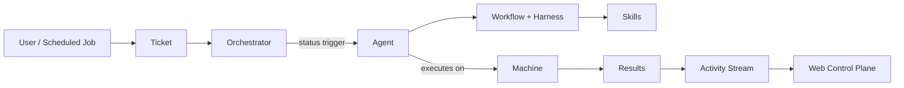

<p align="center">
  
</p>

<h1 align="center">OpenASE<br><sub>Ticket-Driven Automated Software Engineering</sub></h1>

<p align="center">
  <strong>OpenASE</strong> is an all-in-one platform that turns tickets into working code — AI agents automatically pick up tickets, execute workflows on your machines, and deliver results with full traceability.
</p>

<p align="center">
  <a href="#-from-zero-to-running"></a>
  <a href="docs/guide/en/index.md"></a>
  <a href="docs/guide/zh/index.md"></a>
  <a href="LICENSE"></a>
</p>

<p align="center">
  
  
  
  
  
</p>

---

## 🖼️ Product Screenshots

<p align="center">
  The embedded web UI covers ticket orchestration, AI-assisted planning, skill authoring, and live project tracking.
</p>

<p align="center">
  
</p>
<p align="center">
  <strong>Live execution</strong><br>
  Monitor real project work as tickets move across backlog, todo, in-progress, and review.
</p>

<table align="center" width="100%">
<tr>
<td width="50%" align="center" style="vertical-align: top; padding: 12px;">
  
  <p><strong>Ticket board</strong><br>Manage backlog and execution flow with a kanban-style ticket view.</p>
</td>
<td width="50%" align="center" style="vertical-align: top; padding: 12px;">
  
  <p><strong>Project AI</strong><br>Break work into tickets and inspect workspace context directly beside the board.</p>
</td>
</tr>
<tr>
<td colspan="2" align="center" style="vertical-align: top; padding: 12px;">
  
  <p><strong>Skill editor</strong><br>Edit built-in or custom skills that drive repeatable automation workflows.</p>
</td>
</tr>
</table>

---

## 🤔 What is OpenASE?

OpenASE is a **single Go binary** that ships an API server, workflow orchestrator, and embedded web UI together. It follows a **ticket-driven** model: every piece of work is a ticket, every ticket has a workflow, and AI agents automatically pick up and execute tickets based on status triggers.

```
You create a ticket  →  Orchestrator detects pickup status
    →  Agent claims the ticket  →  Executes workflow on a Machine
    →  Activity stream records every step  →  Ticket completes
```

**No Node.js at runtime** — the SvelteKit frontend is compiled and embedded into the Go binary via `go:embed`.

---

## 🧭 Why OpenASE Exists

AI coding agents are powerful — but only when humans stay in control. OpenASE is built around two complementary modes of human–agent interaction:

### Asynchronous AI — Ticket Agents

When requirements are clear and a **Harness** (a hard-boundary document that constrains agent behavior) is in place, the **Ticket Agent** executes the entire task autonomously. It follows the Workflow's instructions, updates ticket statuses, and completes the work — humans don't need to babysit. Two common patterns:

- **Fullstack Coder** — A single agent handles the entire lifecycle (`Todo → In Progress → In Review → Merging → Done`).
- **Mixed Relay** — Multiple specialized agents collaborate (`Design → Backend → Frontend → Testing → In Review → Merging → Done`), each responsible for one stage.

### Synchronous AI — Project AI

When requirements are vague or you want to explore before committing to tickets, start a conversation with **Project AI** — a synchronous assistant in the control plane sidebar. Each tab runs in its own isolated workspace; tabs are independent, parallel, and easy to manage. Project AI can read tickets/workflows/skills, edit harnesses and skills, operate git, and trigger agent runs. As you navigate, it switches between **Workflow / Skill / Ticket / Machine** focus modes automatically.

### Skills — Extending What Agents Can Do

Skills are reusable instruction documents that give agents extra capabilities. Every Workflow auto-binds a built-in **Ticket Skill** so agents know how to drive status flow. You can bind more built-in skills, author custom ones in the Skill Editor, or import them from your repo. Bound skills are injected into the CLI agent's skill directory at runtime (`.codex/skills/`, `.claude/skills/`, `.gemini/skills/`).

### Organization & Project Management

OpenASE supports **multi-Organization** management out of the box. Each Org contains its own Projects, tickets, workflows, skills, machines, and providers. Cross-Org team collaboration is **WIP**.

### ⚠️ Security Notice

To maximize unattended Workflow execution, OpenASE launches CLI agents with **permissive flags by default** (`--dangerously-skip-permissions` for Claude Code, `--yolo` for Codex). Agents can read, write, and execute arbitrary commands on the host without per-action confirmation. You can switch to standard interactive mode per-provider in **Provider settings**.

- Only run OpenASE on machines where you trust the agent's scope of access.
- **This project is NOT designed for public-facing deployment** — it targets local dev, private networks, and trusted environments.
- Browser access is always authorization-gated. Fresh installs use **local bootstrap links**; networked deployments should move to **HTTPS + OIDC** (see [OIDC & RBAC Guide](docs/en/human-auth-oidc-rbac.md)).

> Both async and sync AI support multiple agent CLIs. **Claude Code** and **Codex** are recommended for production use; **Gemini CLI** is supported but less stable.

---

## ✨ Key Features

<table align="center" width="100%">
<tr>
<td width="33%" align="center" style="vertical-align: top; padding: 15px;">

<h3>📋 Ticket-Driven Orchestration</h3>

<p align="center"><strong>Kanban Board & List Views</strong></p>
<p align="center"><strong>Parent/Child & Dependency Tracking</strong></p>
<p align="center"><strong>Custom Statuses & Priorities</strong></p>
<p align="center"><strong>Repository Scope Binding</strong></p>

</td>
<td width="33%" align="center" style="vertical-align: top; padding: 15px;">

<h3>🤖 Multi-Agent Support</h3>

<p align="center"><strong>Claude Code / Codex / Gemini CLI</strong></p>
<p align="center"><strong>Real-time Streaming Output (SSE)</strong></p>
<p align="center"><strong>Agent Lifecycle Management</strong></p>
<p align="center"><strong>Concurrent Execution Control</strong></p>

</td>
<td width="33%" align="center" style="vertical-align: top; padding: 15px;">

<h3>⚡ Workflow Engine</h3>

<p align="center"><strong>Markdown Harness Documents</strong></p>
<p align="center"><strong>Skill Binding & Lifecycle Hooks</strong></p>
<p align="center"><strong>Scheduled Cron Jobs</strong></p>
<p align="center"><strong>Built-in Role Templates</strong></p>

</td>
</tr>
<tr>
<td width="33%" align="center" style="vertical-align: top; padding: 15px;">

<h3>🖥️ Machine Management</h3>

<p align="center"><strong>Local / Direct-Connect / Reverse-Connect</strong></p>
<p align="center"><strong>Websocket Execution + SSH Bootstrap</strong></p>
<p align="center"><strong>Health Probes & Resource Metrics</strong></p>
<p align="center"><strong>Connectivity Diagnostics</strong></p>

</td>
<td width="33%" align="center" style="vertical-align: top; padding: 15px;">

<h3>🔐 Auth & Security</h3>

<p align="center"><strong>OIDC Browser Login (Auth0, Entra ID)</strong></p>
<p align="center"><strong>Agent Platform Token Auth</strong></p>
<p align="center"><strong>Org & Project RBAC</strong></p>
<p align="center"><strong>GitHub Credential Management</strong></p>

</td>
<td width="33%" align="center" style="vertical-align: top; padding: 15px;">

<h3>📡 Observability</h3>

<p align="center"><strong>Live Activity Event Stream</strong></p>
<p align="center"><strong>Agent Run Step Tracking</strong></p>
<p align="center"><strong>GitHub Webhook Ingestion</strong></p>
<p align="center"><strong>Project Update Threads</strong></p>

</td>
</tr>
</table>

---

## 🚀 From Zero to Running

### Fast Path: One-Command Installer

For fresh Linux or macOS machines:

```bash
curl -fsSL https://raw.githubusercontent.com/pacificstudio/openase/main/scripts/install.sh | sh
```

The installer detects OS/arch/package managers, downloads and verifies the matching GitHub release, offers PostgreSQL bootstrap (system package or Docker), and writes a runnable `~/.openase/config.yaml` and `~/.openase/.env`.

To pin a specific version:

```bash
curl -fsSL https://raw.githubusercontent.com/pacificstudio/openase/main/scripts/install.sh | sh -s -- --version <version>
```

### Build From Source

```bash
git clone https://github.com/PacificStudio/openase.git
cd openase
make build-web              # build frontend + Go binary
./bin/openase setup         # interactive first-run setup
./bin/openase all-in-one --config ~/.openase/config.yaml
```

The control plane is then available at `http://127.0.0.1:19836`.

For prerequisite installs (Go, Node, PostgreSQL, agent CLIs), full setup walkthrough, run modes (managed user service, split-process, env-only), and validation steps, see the [Source Build & Startup Guide](docs/en/source-build-and-run.md).

### What's Next?

Follow the User Guide — Quick Start ([EN](docs/guide/en/startup.md) | [中文](docs/guide/zh/startup.md)) to configure ticket statuses, register a machine and agent, create your first workflow, and watch the agent execute.

---

## 📊 Roadmap

| Priority | Item | Description |
|----------|------|-------------|
| 🟡 Medium | **Remote Runtime Operations** | Expand rollout automation, dashboards, and operator tooling around the websocket-only remote runtime plane |
| 🟡 Medium | **Windows Support** | Native service management and shell-script support outside WSL2 |
| 🟡 Medium | **Notification Channels** | Webhook, Telegram, Slack, and WeCom notification delivery |
| 🟡 Medium | **iOS & Android App** | Mobile control plane for monitoring and managing projects on the go |
| 🟡 Medium | **Desktop All-in-One App** | Standalone desktop application bundling the full OpenASE experience |
| 🟡 Medium | **Kubernetes Runtime** | Run agent workloads on Kubernetes clusters for elastic scaling |
| 🟢 Future | **Multi-org Collaboration** | Cross-organization project sharing and permissions |
| 🟢 Future | **Plugin Ecosystem** | Third-party plugin support for custom tools and integrations |
| 🟢 Stable | **Metrics Dashboard** | Agent performance metrics, ticket throughput analytics |

---

## 🖥️ Control Plane

| Module | Capabilities |
|--------|-------------|
| **[Tickets](docs/guide/en/tickets.md)** | Kanban board, list view, filtering, comments, dependencies, repository scoping |
| **[Agents](docs/guide/en/agents.md)** | Registration, real-time run monitoring, pause/resume/retire lifecycle |
| **[Machines](docs/guide/en/machines.md)** | SSH/local/cloud registration, health probes, resource metrics |
| **[Workflows](docs/guide/en/workflows.md)** | Harness editing, status binding, skill binding, version history, impact analysis |
| **[Skills](docs/guide/en/skills.md)** | Built-in & custom skill management, workflow binding |
| **[Scheduled Jobs](docs/guide/en/scheduled-jobs.md)** | Cron-based ticket creation, manual trigger, enable/disable |
| **[Activity](docs/guide/en/activity.md)** | Real-time event stream, type filtering, keyword search |
| **[Updates](docs/guide/en/updates.md)** | Team progress threads, comments, revision history |
| **[Settings](docs/guide/en/settings.md)** | Statuses, repositories, notifications, security, archived tickets |

---

## 🏗️ Architecture

| Principle | Description |
|-----------|-------------|
| **All-Go Monolith** | API server, orchestrator, setup flow, and embedded UI in one binary |
| **Binary-first** | Web UI embedded via `go:embed` — no Node.js at runtime |
| **Ticket-driven** | Tickets, workflows, statuses, and activity are the core operating model |
| **Multi-agent** | Adapter-based support for Claude Code, Codex, and Gemini CLI |
| **Git-backed** | Workflow harnesses and skills are repo-aware at runtime |



For repository layout, build commands, and quality gates, see the [Development Guide](docs/en/development.md).

---

## 📖 Documentation

| Document | EN | 中文 |
|----------|----|----|
| **User Guide** | [English](docs/guide/en/index.md) | [中文](docs/guide/zh/index.md) |
| Getting Started | [English](docs/guide/en/startup.md) | [中文](docs/guide/zh/startup.md) |
| Module Architecture | [English](docs/guide/en/architecture.md) | [中文](docs/guide/zh/architecture.md) |
| FAQ | [English](docs/guide/en/faq.md) | [中文](docs/guide/zh/faq.md) |
| **Source Build & Startup** | [English](docs/en/source-build-and-run.md) | [中文](docs/zh/source-build-and-run.md) |
| Configuration Reference | [English](docs/en/configuration.md) | — |
| CLI Reference | [English](docs/en/cli-reference.md) | — |
| Development Guide | [English](docs/en/development.md) | — |
| IAM Dual-Mode Contract | [English](docs/en/iam-dual-mode-contract.md) | [中文](docs/zh/iam-dual-mode-contract.md) |
| WebSocket Runtime Contract | [English](docs/en/websocket-runtime-contract.md) | [中文](docs/zh/websocket-runtime-contract.md) |
| OIDC & RBAC | [English](docs/en/human-auth-oidc-rbac.md) | [中文](docs/zh/human-auth-oidc-rbac.md) |
| Observability | [English](docs/en/observability-checklist.md) | [中文](docs/zh/observability-checklist.md) |
| Remote Runtime v1 Rollout | [English](docs/en/remote-websocket-rollout.md) | [中文](docs/zh/remote-websocket-rollout.md) |
| Gemini CLI Adaptation | [English](docs/en/gemini-cli-adaptation-guide.md) | [中文](docs/zh/gemini-cli-adaptation-guide.md) |
| Claude Code Stream Protocol | [English](docs/en/claude-code-stream-protocol.md) | [中文](docs/zh/claude-code-stream-protocol.md) |

---

## ⭐ Star History

<p align="center">
  <a href="https://star-history.com/#PacificStudio/openase&Date">
    
  </a>
</p>

---

## 📄 License

See [LICENSE](LICENSE).

## Friendly Link

[linux.do](https://linux.do/latest)

---

<p align="center">
  <strong>OpenASE</strong>
  <br>
  <em>Create the ticket. The agent does the rest.</em>
</p>
