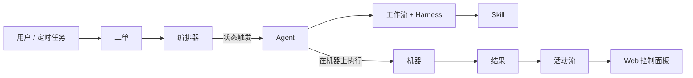

<p align="center">
  
</p>

<h1 align="center">OpenASE<br><sub>工单驱动的自动化软件工程</sub></h1>

<p align="center">
  <strong>OpenASE</strong> 是一个一站式平台,将工单转化为可运行的代码 — AI Agent 自动认领工单,在你的机器上执行工作流,并以完整的可追溯性交付成果。
</p>

<p align="center">
  <a href="#-从零开始运行"></a>
  <a href="docs/guide/zh/index.md"></a>
  <a href="docs/guide/en/index.md"></a>
  <a href="LICENSE"></a>
</p>

<p align="center">
  
  
  
  
  
</p>

---

## 🖼️ 产品截图

<p align="center">
  内嵌的 Web UI 涵盖工单编排、AI 辅助规划、Skill 编写和实时项目追踪。
</p>

<p align="center">
  
</p>
<p align="center">
  <strong>实时执行</strong><br>
  监控真实项目工作,工单在 Backlog、Todo、In Progress、Review 之间流转。
</p>

<table align="center" width="100%">
<tr>
<td width="50%" align="center" style="vertical-align: top; padding: 12px;">
  
  <p><strong>工单看板</strong><br>以看板视图管理待办和执行流程。</p>
</td>
<td width="50%" align="center" style="vertical-align: top; padding: 12px;">
  
  <p><strong>Project AI</strong><br>在看板旁边拆解工作为工单,检查工作区上下文。</p>
</td>
</tr>
<tr>
<td colspan="2" align="center" style="vertical-align: top; padding: 12px;">
  
  <p><strong>Skill 编辑器</strong><br>编辑内置或自定义 Skill,驱动可复用的自动化工作流。</p>
</td>
</tr>
</table>

---

## 🤔 什么是 OpenASE?

OpenASE 是一个**单 Go 二进制文件**,将 API 服务器、工作流编排器和内嵌的 Web UI 打包在一起。它遵循**工单驱动**模型:每项工作都是一个工单,每个工单都有工作流,AI Agent 根据状态触发器自动认领并执行工单。

```
你创建一个工单  →  编排器检测到认领状态
    →  Agent 认领工单  →  在机器上执行工作流
    →  活动流记录每一步  →  工单完成
```

**运行时无需 Node.js** — SvelteKit 前端通过 `go:embed` 编译嵌入到 Go 二进制文件中。

---

## 🧭 为什么需要 OpenASE

AI 编码 Agent 非常强大 — 但前提是人类保持控制。OpenASE 围绕两种互补的人机交互模式构建:

### 异步 AI — Ticket Agent

当需求明确、**Harness**(约束 Agent 行为的硬边界文档)已就绪时,**Ticket Agent** 全自动执行整个任务。它遵循 Workflow 指示,更新工单状态,完成工单描述的工作 — 人类无需看护。两种常见模式:

- **全栈编码** — 单个 Agent 处理整个生命周期(`Todo → In Progress → In Review → Merging → Done`)。
- **混合接力** — 多个专业 Agent 接力协作(`Design → Backend → Frontend → Testing → In Review → Merging → Done`),每个阶段由一种 Agent 角色负责。

### 同步 AI — Project AI

当需求模糊、或想在创建工单前做探索时,在控制面板侧边栏与 **Project AI** 对话。每个标签页运行在独立、隔离的工作区;标签页互不干扰,可并行,便于并排管理。Project AI 可读取工单/工作流/Skill、修改 Harness 与 Skill、操作 git、触发 Agent 执行。随着你在控制面板中导航,它会自动在 **Workflow / Skill / Ticket / Machine** 四种聚焦模式之间切换。

### Skill — 扩展 Agent 能力

Skill 是可复用的指令文档,赋予 Agent 超越原始编码的额外能力。每个 Workflow 自动绑定内置 **Ticket Skill**,教会 Agent 驱动状态流转。你可以绑定更多内置 Skill、在 Skill 编辑器中创建自定义 Skill,或从仓库导入。绑定的 Skill 会在运行时注入到 CLI Agent 的 Skill 目录(`.codex/skills/`、`.claude/skills/`、`.gemini/skills/`)。

### 组织与项目管理

OpenASE 开箱即用支持**多组织(Org)**管理。每个 Org 包含自己的项目、工单、工作流、Skill、机器与 Provider 配置。跨 Org 的团队协作目前**WIP**。

### ⚠️ 安全提醒

为了最大化无人值守 Workflow 的执行效率,OpenASE 默认以**宽松权限标志**启动 CLI Agent(Claude Code 的 `--dangerously-skip-permissions`、Codex 的 `--yolo`)。Agent 可以在宿主机上读写和执行任意命令,无需逐次确认。你可以在 **Provider 设置**中按 Provider 切换为标准交互模式。

- 仅在你信任 Agent 访问范围的机器上运行 OpenASE。
- **本项目不是为公网部署设计的** — 它面向本地开发、私有网络和受信任的环境。
- 浏览器访问始终先经过授权门禁。全新安装默认使用 **local bootstrap 链接**;网络化部署应尽快切换到 **HTTPS + OIDC**(参见 [OIDC & RBAC 指南](docs/zh/human-auth-oidc-rbac.md))。

> 异步和同步 AI 均支持多种 Agent CLI。推荐使用 **Claude Code** 和 **Codex**;**Gemini CLI** 已支持但稳定性较差。

---

## ✨ 核心特性

<table align="center" width="100%">
<tr>
<td width="33%" align="center" style="vertical-align: top; padding: 15px;">

<h3>📋 工单驱动编排</h3>

<p align="center"><strong>看板 & 列表视图</strong></p>
<p align="center"><strong>父子 & 依赖追踪</strong></p>
<p align="center"><strong>自定义状态 & 优先级</strong></p>
<p align="center"><strong>仓库范围绑定</strong></p>

</td>
<td width="33%" align="center" style="vertical-align: top; padding: 15px;">

<h3>🤖 多 Agent 支持</h3>

<p align="center"><strong>Claude Code / Codex / Gemini CLI</strong></p>
<p align="center"><strong>实时流式输出(SSE)</strong></p>
<p align="center"><strong>Agent 生命周期管理</strong></p>
<p align="center"><strong>并发执行控制</strong></p>

</td>
<td width="33%" align="center" style="vertical-align: top; padding: 15px;">

<h3>⚡ 工作流引擎</h3>

<p align="center"><strong>Markdown Harness 文档</strong></p>
<p align="center"><strong>Skill 绑定 & 生命周期钩子</strong></p>
<p align="center"><strong>定时 Cron 任务</strong></p>
<p align="center"><strong>内置角色模板</strong></p>

</td>
</tr>
<tr>
<td width="33%" align="center" style="vertical-align: top; padding: 15px;">

<h3>🖥️ 机器管理</h3>

<p align="center"><strong>本地 / 直连 / 反向连接</strong></p>
<p align="center"><strong>WebSocket 执行 + SSH 引导</strong></p>
<p align="center"><strong>健康探针 & 资源指标</strong></p>
<p align="center"><strong>连接诊断</strong></p>

</td>
<td width="33%" align="center" style="vertical-align: top; padding: 15px;">

<h3>🔐 认证 & 安全</h3>

<p align="center"><strong>OIDC 浏览器登录(Auth0、Entra ID)</strong></p>
<p align="center"><strong>Agent 平台 Token 认证</strong></p>
<p align="center"><strong>Org & 项目 RBAC</strong></p>
<p align="center"><strong>GitHub 凭证管理</strong></p>

</td>
<td width="33%" align="center" style="vertical-align: top; padding: 15px;">

<h3>📡 可观测性</h3>

<p align="center"><strong>实时活动事件流</strong></p>
<p align="center"><strong>Agent 运行步骤追踪</strong></p>
<p align="center"><strong>GitHub Webhook 接入</strong></p>
<p align="center"><strong>项目动态线程</strong></p>

</td>
</tr>
</table>

---

## 🚀 从零开始运行

### 快速路径:一条命令安装

对于全新的 Linux 或 macOS 机器:

```bash
curl -fsSL https://raw.githubusercontent.com/pacificstudio/openase/main/scripts/install.sh | sh
```

安装脚本会检测 OS/架构/包管理器、下载并校验匹配的 GitHub Release、提供 PostgreSQL 引导(系统包或 Docker),并写入可直接运行的 `~/.openase/config.yaml` 和 `~/.openase/.env`。

固定指定版本:

```bash
curl -fsSL https://raw.githubusercontent.com/pacificstudio/openase/main/scripts/install.sh | sh -s -- --version v0.4.0
```

### 从源码构建

```bash
git clone https://github.com/PacificStudio/openase.git
cd openase
make build-web              # 构建前端 + Go 二进制
./bin/openase setup         # 交互式首次安装
./bin/openase all-in-one --config ~/.openase/config.yaml
```

控制面板随后可访问:`http://127.0.0.1:19836`。

完整的前置条件安装(Go、Node、PostgreSQL、Agent CLI)、详细安装流程、运行模式(托管用户服务、分离进程、纯环境变量)与校验步骤,参见[源码构建与启动指南](docs/zh/source-build-and-run.md)。

### 接下来?

参照用户指南 — 快速开始([EN](docs/guide/en/startup.md) | [中文](docs/guide/zh/startup.md))配置工单状态、注册机器与 Agent、创建第一个工作流,并观察 Agent 自动执行。

---

## 📊 路线图

| 优先级 | 项目 | 描述 |
|--------|------|------|
| 🟡 中 | **远程运行时运维** | 扩展 WebSocket 远程运行时的灰度自动化、仪表板与运维工具链 |
| 🟡 中 | **Windows 支持** | WSL2 之外的原生服务管理和 Shell 脚本支持 |
| 🟡 中 | **通知渠道** | Webhook、Telegram、Slack 和 WeCom 通知投递 |
| 🟡 中 | **iOS & Android App** | 移动端控制面板,随时随地监控和管理项目 |
| 🟡 中 | **桌面一体化应用** | 独立桌面应用,打包完整的 OpenASE 体验 |
| 🟡 中 | **Kubernetes 运行时** | 在 Kubernetes 集群上运行 Agent 工作负载,实现弹性伸缩 |
| 🟢 远期 | **多组织协作** | 跨组织项目共享和权限 |
| 🟢 远期 | **插件生态** | 第三方插件支持,自定义工具和集成 |
| 🟢 远期 | **指标仪表板** | Agent 性能指标、工单吞吐量分析 |

---

## 🖥️ 控制面板

| 模块 | 功能 |
|------|------|
| **[工单](docs/guide/zh/tickets.md)** | 看板、列表视图、过滤、评论、依赖、仓库范围 |
| **[Agent](docs/guide/zh/agents.md)** | 注册、实时运行监控、暂停/恢复/退役生命周期 |
| **[机器](docs/guide/zh/machines.md)** | SSH/本地/云注册、健康探针、资源指标 |
| **[工作流](docs/guide/zh/workflows.md)** | Harness 编辑、状态绑定、Skill 绑定、版本历史、影响分析 |
| **[Skill](docs/guide/zh/skills.md)** | 内置 & 自定义 Skill 管理、工作流绑定 |
| **[定时任务](docs/guide/zh/scheduled-jobs.md)** | 基于 Cron 的工单创建、手动触发、启用/禁用 |
| **[活动](docs/guide/zh/activity.md)** | 实时事件流、类型过滤、关键词搜索 |
| **[动态](docs/guide/zh/updates.md)** | 团队进展线程、评论、修订历史 |
| **[设置](docs/guide/zh/settings.md)** | 状态管理、仓库、通知、安全、归档工单 |

---

## 🏗️ 架构

| 原则 | 说明 |
|------|------|
| **All-Go 单体** | API 服务器、编排器、安装流程和内嵌 UI 在一个二进制文件中 |
| **二进制优先** | Web UI 通过 `go:embed` 嵌入 — 运行时无需 Node.js |
| **工单驱动** | 工单、工作流、状态和活动是核心运作模型 |
| **多 Agent** | 基于适配器支持 Claude Code、Codex 和 Gemini CLI |
| **Git 感知** | Workflow Harness 和 Skill 在运行时感知仓库上下文 |



仓库结构、构建命令与质量门禁参见[开发指南](docs/zh/development.md)。

---

## 📖 文档

| 文档 | EN | 中文 |
|------|----|----|
| **用户指南** | [English](docs/guide/en/index.md) | [中文](docs/guide/zh/index.md) |
| 快速开始 | [English](docs/guide/en/startup.md) | [中文](docs/guide/zh/startup.md) |
| 模块架构 | [English](docs/guide/en/architecture.md) | [中文](docs/guide/zh/architecture.md) |
| FAQ | [English](docs/guide/en/faq.md) | [中文](docs/guide/zh/faq.md) |
| **源码构建与启动** | [English](docs/en/source-build-and-run.md) | [中文](docs/zh/source-build-and-run.md) |
| 配置参考 | [English](docs/en/configuration.md) | [中文](docs/zh/configuration.md) |
| CLI 参考 | [English](docs/en/cli-reference.md) | [中文](docs/zh/cli-reference.md) |
| 开发指南 | [English](docs/en/development.md) | [中文](docs/zh/development.md) |
| IAM 双模式契约 | [English](docs/en/iam-dual-mode-contract.md) | [中文](docs/zh/iam-dual-mode-contract.md) |
| WebSocket 运行时契约 | [English](docs/en/websocket-runtime-contract.md) | [中文](docs/zh/websocket-runtime-contract.md) |
| OIDC & RBAC | [English](docs/en/human-auth-oidc-rbac.md) | [中文](docs/zh/human-auth-oidc-rbac.md) |
| 可观测性 | [English](docs/en/observability-checklist.md) | [中文](docs/zh/observability-checklist.md) |
| Remote Runtime v1 灰度 | [English](docs/en/remote-websocket-rollout.md) | [中文](docs/zh/remote-websocket-rollout.md) |
| Gemini CLI 适配 | [English](docs/en/gemini-cli-adaptation-guide.md) | [中文](docs/zh/gemini-cli-adaptation-guide.md) |
| Claude Code 流协议 | [English](docs/en/claude-code-stream-protocol.md) | [中文](docs/zh/claude-code-stream-protocol.md) |

---

## ⭐ Star History

<p align="center">
  <a href="https://star-history.com/#PacificStudio/openase&Date">
    
  </a>
</p>

---

## 📄 许可证

参见 [LICENSE](LICENSE)。

## 友情链接

[linux.do](https://linux.do/latest)

---

<p align="center">
  <strong>OpenASE</strong>
  <br>
  <em>创建工单,Agent 完成剩下的一切。</em>
</p>
